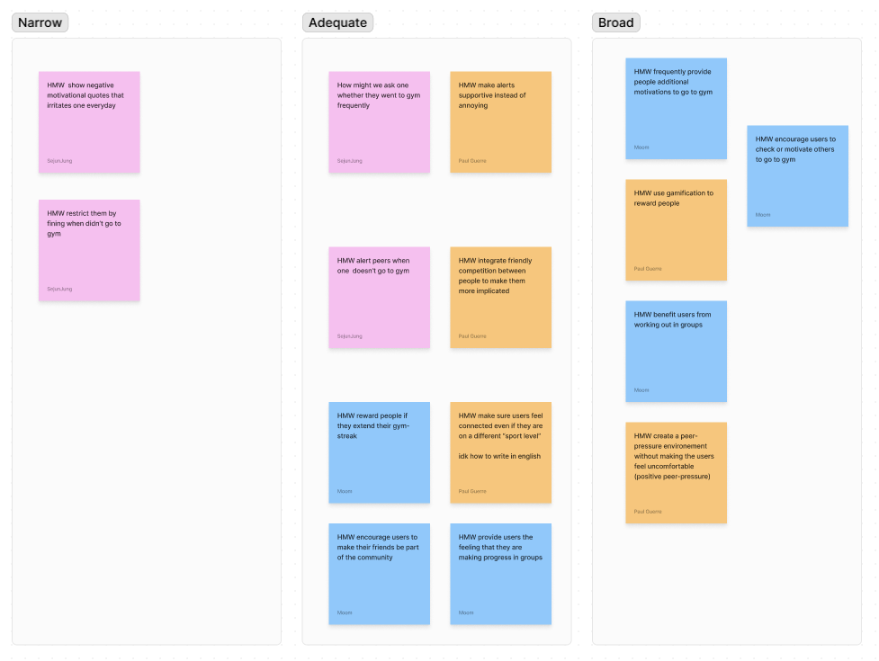
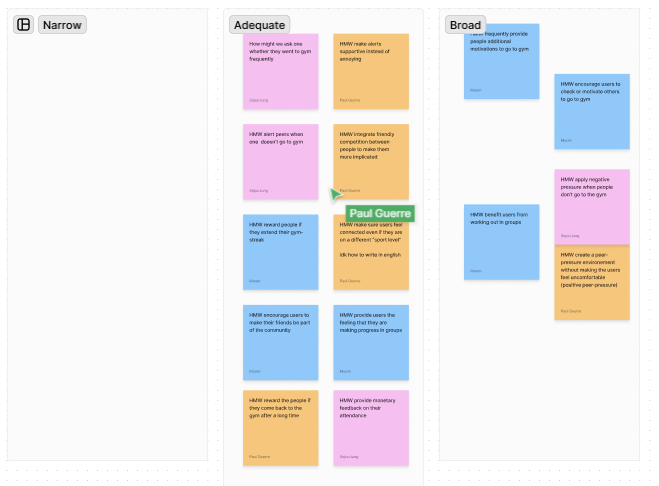
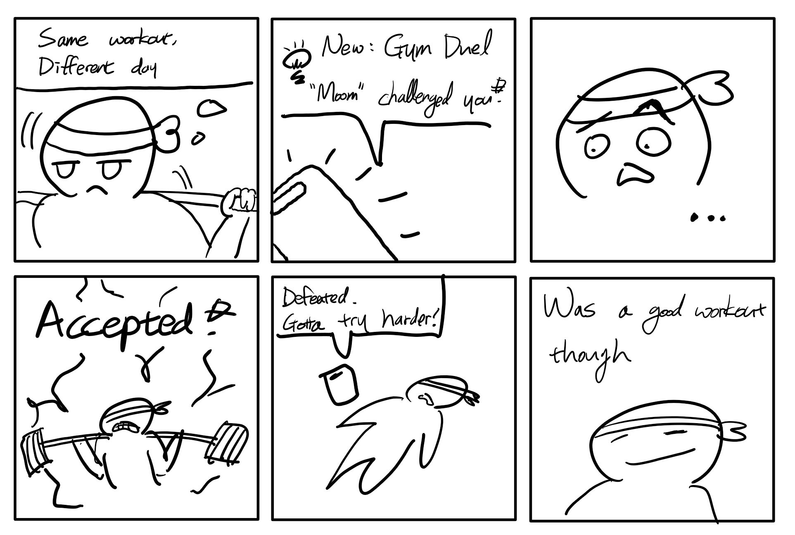
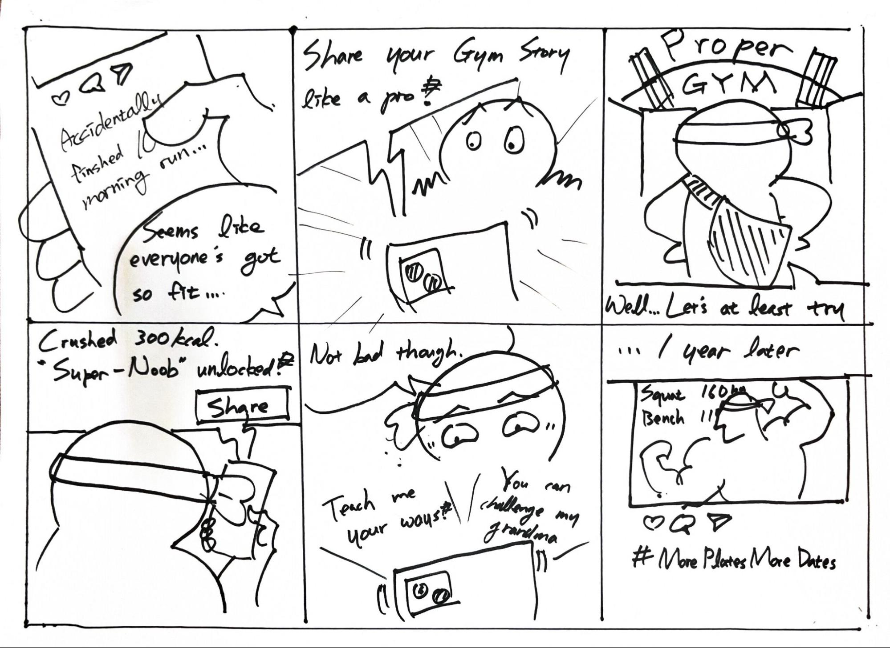

# Design Project 1: Ideation

## Team Escargots

- Paul Guerre
- Sejun Jung
- Yeongung Kim

## Problem Statement

Many gym members struggle to consistently attend the gym on their own.

## Problem Background

It is common knowledge that daily exercising is very important for all the layers of the human body. Nowadays, a lot of people are registered at the gym. But the problem here is that large number of people are only 'registering'. According to the [[1] survey conducted by Korean Health Promotion Institute](#references), 61% of the actual gym members are not going to the gym after paying the membership. The lack of motivation has been identified as the second largest reason why people desert their gym, highlighting the urgent need to implement effective strategies that boost motivation and sense of community. 

## Motivation

By [[2] Durau J, Diehl S, Terlutter R. Motivate me to exercise with you ](#references), the effects of social media fitness influencers on users' intentions to engage in physical activity and the role of user gender, social media fitness influencers who are perceived as trustworthy, as experts and as attractive, can be effective for increasing men's and women's physical activity. Also suggested by [[3] Davis AJ, MacCarron P, Cohen E. Social reward and support effects on exercise experiences and performance](#references), ‘Social rewards’ such as feeling of sharing the physical activity with people in close relationship is associated with more frequent participation and higher life satisfaction. Hence, it is highly likely that applying social computing approach would benefit people to participate in physical activity such as going to gym.

## HMW questions

1. HMW regularly check in with users about their gym activity?
2. HMW make alerts feel like personalized encouragement rather than annoying reminders?
3. HMW leverage negative peer pressure to discourage skipping gym sessions?
4. HMW integrate friendly competition between people to make them more implicated?
5. HMW incentivize users to maintain and extend gym-streaks with rewards?
6. HMW foster a sense of connection among users of different fitness levels?
7. HMW encourage users to make their friends be part of the community?
8. HMW provide users the feeling that they are making progress in groups?
9. HMW recognize and reward the users who return to the gym after long breaks?
10. HMW link monetary feedback to gym attendance?

## Top 3 HMW questions

1. HMW apply negative peer pressure when people don’t go to the gym?
2. HMW integrate friendly competition between people to make them more implicated?
3. HMW encourage users to make their friends be part of the community?

### Selection process

    
    

We first came up with all the HMW we can think of and divided into three groups based on the broadness. Then we manipulated some HMWs that were too broad or narrow, ended up making 10 adequate HMWs. We voted for the good HMWs that each group member thought were good, discussed the HMWs that received the most votes, and ultimately selected 3 HMWs. In making our final decision, we considered the feasibility of implementation and their potential to genuinely motivate people to go to the gym.

## Solution Ideas

- HMW leverage negative peer pressure to discourage skipping gym sessions?
    1. Create a “Hall of Shame” leaderboard highlighting users with the worst attendance
    2. Notify users with a playful message when most of their friends have been to the gym
    3. Allow users to view and track their friend’s gym streak, and reward those who actively nudge others to go
    4. Alert group members about a user’s absence from the gym
    5. Automatically share gym absences with the group, enabling real-time reactions from other users
    6. Enable users to manually send reminders to friends who haven’t been to the gym
- HMW integrate friendly competition between people to make them more implicated?
    1. Create duels between two users or group competitions
    2. Enable users to easily share their gym achievements on social media in a visually appealing manner
    3. Organize challenges with rewards 
    4. Notify users when group members reach goals
    5. Create an avatar-based game with upgrades for gym visits 
    6. Implement a leaderboard and league system 
- HMW encourage users to make their friends be part of the community?
    1. Create a network of enthusiastic users who act as reference points for newcomers 
    2. Target specific communities like universities and schools to promote the product
    3. Reward both user and newcomer when the newcomer uses the affiliate link of the user
    4. Enable users to share their progress and achievements with their networks 
    5. Establish partnerships with physical gyms for seamless integration with the app 

## Top 3 solution ideas

1. Create a “Hall of Shame” leaderboard that highlights users with the worst attendance
2. Organize duels between users and establish group competitions 
3. Enable users to easily share their gym achievements on social media in a visually appealing manner

## Storyboards 

1. Create a “Hall of Shame” leaderboard that highlights users with the worst attendance.

2. Organize duels between users and establish group competitions

3. Enable users to easily share their gym achievements on social media in a visually appealing manner

## Feedback & Iteration

### Feedback Summary

1. Need to distinguish 2 social factor.
    - Public visibility
    - Peer pressure by close relationship
2. 'Hall of Shame' might discourage users.
3. Need more specific features in order to differenciate from existing social computing services.
4. Excessive external motivation might result in loss of internal motivation.

### Agenda & Iteration

1. Distinguishing and identifying two social factors(public visibility / peer pressure)

 We discussed about how might we utilize different social factors for each user groups. Assuming that public visibility might only be effective for outgoing users, while peer pressure seems to be working for most people, we are considering to provide options for visibility scope.

2. Revising 'Hall of Shame' that might discourage users

 We examined on how to make leaderboard less humiliating and beneficial for long-term motivation. By not specifying the rank (or duration) and using nicknames on the ‘Hall of Shame’, we expect users not getting excessive negative pressure. Additional to that, we are considering to provide features such as poking the members on the Hall of Shame, to additionally motivate them rather than discouraging them.

## References

- [1] KHEPI. 2015. https://www.khepi.or.kr/board/view%3FlinkId%3D501805%26menuId%3DMENU00907&ved=2ahUKEwitlvfUneOIAxUcrlYBHQRHAowQFnoECBMQAQ&usg=AOvVaw1884k_a9e28rJ5nBdaMdTc
- [2] Durau J, Diehl S, Terlutter R. Motivate me to exercise with you: The effects of social media fitness influencers on users' intentions to engage in physical activity and the role of user gender. Digit Health. 2022 May 20;8:20552076221102769. doi: 10.1177/20552076221102769. PMID: 35615268; PMCID: PMC9125114. 
- [3] Davis AJ, MacCarron P, Cohen E. Social reward and support effects on exercise experiences and performance: Evidence from parkrun. PLoS One. 2021 Sep 15;16(9):e0256546. doi: 10.1371/journal.pone.0256546. PMID: 34525097; PMCID: PMC8443045.