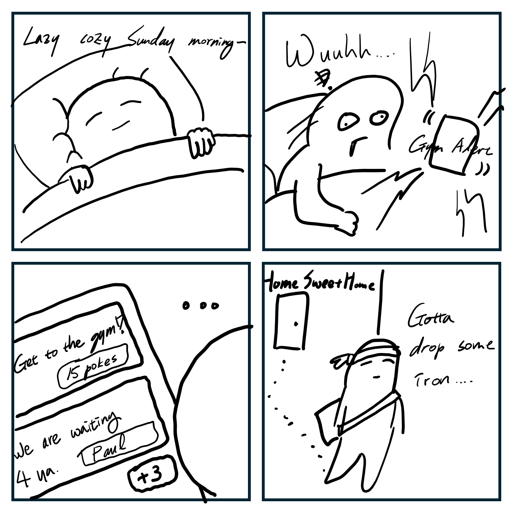
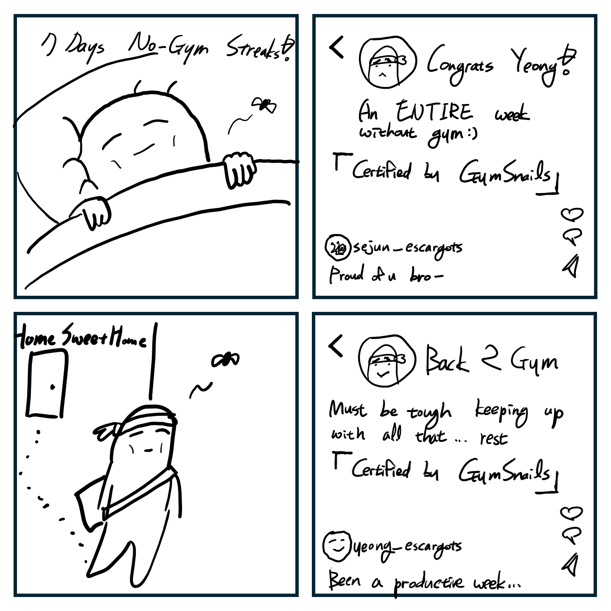
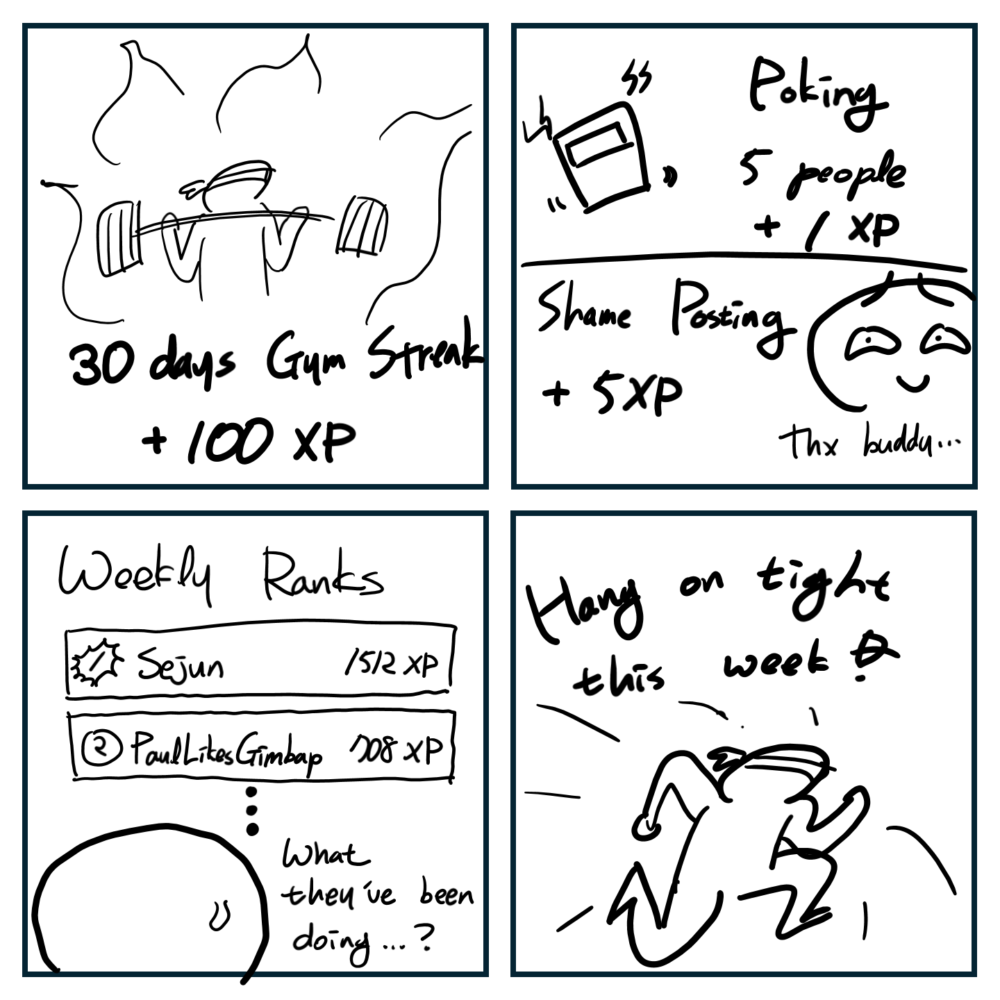
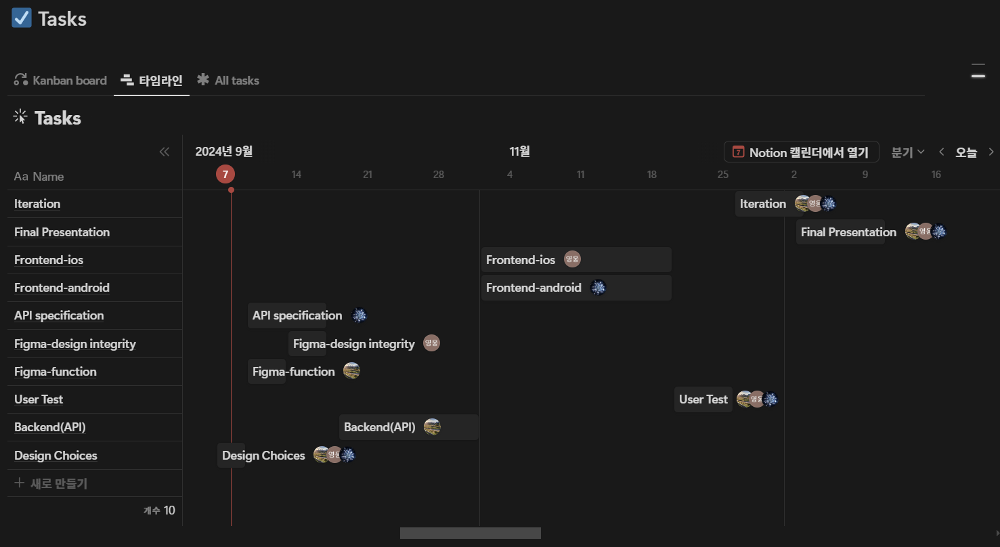

# Design Project 2: Pitch

## Team Escargots

- Paul Guerre
- Sejun Jung
- Yeongung Kim

## Problem Statement

Many gym members struggle to consistently attend the gym on their own since self-motivation can be fluctuating, leading to irregular gym attendance patterns.

## Solution Summary

1. Poking through push alarm
    
    "Poking through push alarm" refers to a feature that sends notifications to users' devices to remind or encourage them to attend the gym.
    
    Users can simply poke others who’s not attending the gym, or broadcast poking messages to join his/her workout session together.
    
    
    
2. Shame posting
    
    Shame posting is a social feature designed to motivate gym attendance by publicly sharing or highlighting instances of poor attendance or missed workouts. Depending on users’ preference, this approach leverages social pressures, ranging from peer pressure to public visibility and potential embarrassment as a motivational tool. For the sake of repairing the reputation, shame-posted users can back-to-gym post if they returned to the gym.
    
    
    
3. Hall of Fame
    
    The "Hall of Fame" is a gamification feature that recognizes and showcases users with outstanding gym attendance or achievements. Users are ranked by XPs they earned each week by completing quests such as poking certain number of people or extending gym streaks. It serves as a positive motivational tool by highlighting successful members and their accomplishments, adding a competitive element to the gym experience.
    
    
    

## Core Tasks

1. Fill the mandatory information
    
    This core task involves the initial app setup where users agree to receive push notifications reminding them to go to the gym. Additionally, they consent to their friends potentially posting on social media about their gym attendance (or lack thereof). And finally the user is required to input their current gym schedule (or desired one). Based on this schedule, the app enables friends to send notifications when users fail to attend the gym.
    
2. Encourage friends through app notifications
    
    Users can review a list of their friends who have not attended the gym according to their scheduled plans. From this list, they can choose to send notifications to these friends, motivating them to stick to their workout routine.
    
3. Share updates on social media when friends miss gym sessions
    
    Users can check the list of their friends who have not been attending the gym according to their schedule. They can then choose to share this information on social networks, using the app’s feature to publicly highlight missed gym sessions.
    
4. Check the Hall of Fame
    
    This core task involves the “Hall of Fame,” where users are ranked according to their gym attendance. They can check their own ranking as well as compare it with their friends’ standings.
    

## Competitive Analysis

### Existing Solutions

1. Sound Gym 

    An online platform for audio professionals to improve their listening skills through interactive sound-based training, gamified exercises, and competitions between users.

2. Panfit

    A fitness app offering personalized workout plans, gym attendance tracking, and wearable device integration to help users stay on top of their fitness goals.

3. Nike Run Club (NRC)

    A running app with GPS tracking, personalized coaching, guided runs, and community challenges to motivate runners and improve their performance.

### Feature Comparison

1. Notification System

    - Team Escargots: Strong - Uses poking through push notifications(individual, joining) / Notification through familiar SNS
    - Sound Gym: Moderate - Workout reminders, Progress updates
    - Planfit: Weak- Progress updates
    - Nike Run Club: Strong - Offers run reminders and achievement notifications

2. Friend System

    - Team Escargots: Strong - Friend interactions very close to the real world, allowing keep in track and poking one another
    - Sound Gym: Moderate - Following system
    - Planfit: Moderate - Following system
    - Nike Run Club: Strong - Allows adding friends for motivation

3. Community/Social Media

    - Team Escargots: Moderate - Features Hall of Fame/ High user engagement through poking/ Provide easy sharing through social media
    - Sound Gym: Strong - Robust community features and social sharing connected to apple health
    - Planfit: Weak - Limited community aspects - few users w/o connection to popular SNS
    - Nike Run Club: Strong - Robust community features and social sharing

4. Gamification

    - Team Escargots: Super Strong - Uses shame posting and weekly ranked Hall of Fame as gamification elements
    - Sound Gym: Strong - Features leaderboard, challenges and achievements
    - Planfit: Moderate - Incorporates goal setting, progress tracking and leaderboard
    - Nike Run Club: Strong - Features leaderboard, challenges and achievements

5. Workout Variety (for gym-goers)

    - Team Escargots: Strong- Specifically designed for gym-goers
    - Sound Gym: Strong - Offers a wide variety of audio-guided exercises
    - Planfit: Strong - Comprehensive exercise library with video demonstrations
    - Nike Run Club: Limited - Focused primarily on running workouts

### Analysis Summary & Conclusion

| **Criteria** | **Team Escargots** | **Sound Gym** | **Planfit** | **Nike Run Club** |
| --- | --- | --- | --- | --- |
| Notification System | Strong | Moderate | Weak | Strong |
| Friend System | Strong | Moderate | Weak | Strong |
| Community/Social Media | Moderate | Strong | Weak | Strong |
| Gamification | Super Strong | Strong | Moderate | Strong |
| Workout Variety | Strong | Strong | Strong | Limited |

 Team Escargots stands out with real-world friend interactions, SNS-based notifications, and unique gamification through "poking" and weekly ranked Hall of Fame features, offering more social accountability than competitors.

## Timeline and Responsibilities

