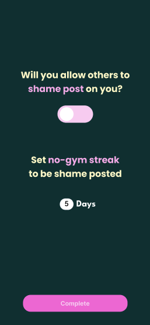
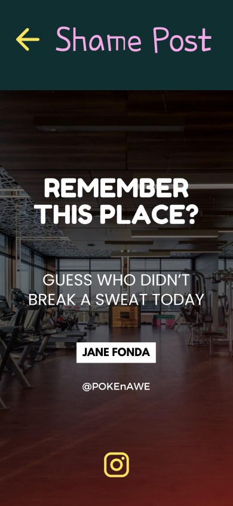
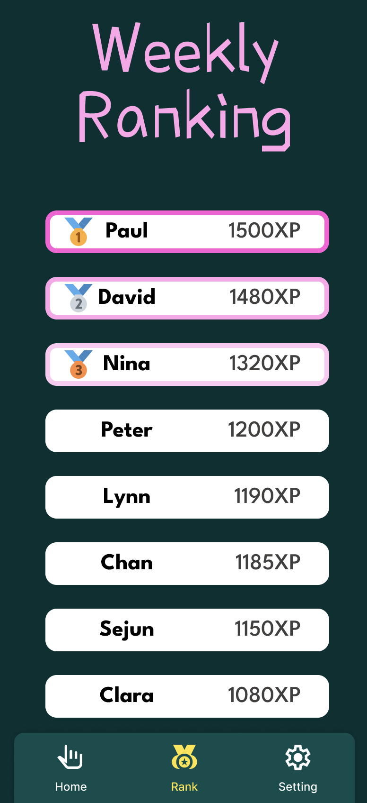
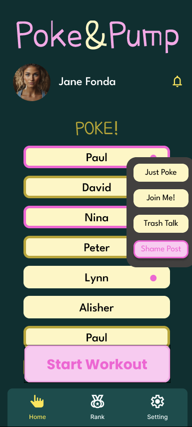

# Design Project Milestone 3: Low-fidelity Prototyping

## Team Escargots

- Paul Guerre
- Sejun Jung
- Yeongung Kim

## Problem Statement

Many gym members struggle to consistently attend the gym on their own since self-motivation can be fluctuating, leading to irregular gym attendance patterns.**⁠**

## Tasks

1. Get Onboarded, Check Poke Alarm, and Start Your Workout

    - After installing the app, complete the initial setup by customising your profile, visibility settings, workout plans and shame post setting.
    - Shortly after, you'll receive a poke notification from someone via your phone’s alarm. This poke is designed to motivate you.
    - Inspired by the poke, start your workout session. Once started, check the XP you've earned.

2. Poke a Friend to Motivate Them

    - You feel like motivating a friend, so add them to your list and send them a poke.
    - Choose from three poke options:
        - **Just Poke**: A gentle reminder to get active.
        - **Join Me**: Encourage them to work out with you.
        - **Trash Talk**: Playfully challenge them to compete with you.

3. Check the Weekly Ranking and Shame Post a Friend

    - View the weekly XP leaderboard to see how you rank against other users.
    - Knowing shame posting will award you with XP, you decide to shame post your friend. Use the app's provided Instagram story template to call them out and motivate them to step up their game.

### Summary

 Our solution is an application that allows people to poke friends and others to motivate them to go to the gym. It can be a simple push notification or a post shared on social networks. The application also includes a weekly ranking leaderboard based on an XP system related to the app’s usage and the user’s consistency. By using peer pressure and gamification, this app will motivate people to go to the gym, either to avoid being exposed on social networks or to improve their ranking on the app. 

## Prototype

[Figma Prototype Link](https://www.figma.com/proto/mg2MCKneUDZbem3kiG4JZy/Pokemon?node-id=75-587&starting-point-node-id=75:587&show-proto-sidebar=1&t=JIAIBdTlZkKcvw3E-1)

### Design choices

- **Predefined list of friends (Hardcoded list of poke-es)**

 To streamline the prototyping process, we preloaded a list of friends to interact with. This avoids the complexity of creating a dynamic friend management system during early development.

- **Simplified user identification**

 We opted for basic user identification, which only uses the nickname, to minimize authentication overhead, ensuring the prototype focuses on core functionality rather than complex login processes.

- **Hardcoded workout schedule**

 A predefined workout schedule is provided on the onboarding steps, since we considered selecting days of a weekly-repeated task as a general UI which does not require actual in-detail implementation.

- **Simplified notifications**

 Notifications have been simplified to avoid unnecessary complexities, since each platform (Android and iOS) has different format of push alarms. We focused on delivering that our service provides on-device notifications for certain use cases.

- **No instructions on friend request approval**

 We eliminated the ‘approval’ step for friend request. The first reason is that we already provide predefined(hardcoded) friend list in the prototype, and there’s no task about adding a friend in our service. The other reason is that since requesting and accepting friend request are fairly universal user interfaces, users probably do not need detailed explanation of the friend system.

- **Prototype flow restricted to intended scenarios**

 Specific flows are hardcoded to function as designed, ensuring the prototype demonstrates key features smoothly and minimizes unexpected behavior

### Screenshots

[Allow users to set their shame post conditions]

[Shame post template provided from app]

[Weekly ranking leaderboard based on XP system]

[main page with poke list where you can easliy poke in various ways]

### Instructions

#### Task 1
1. Splash screen of the app in order to start the onboarding
2. Enter your nickname
3. Choose the visibility, either “Friends” or “Anyone”
4. Choose the workout schedule
5. Choose to allow shame posting or not
6. Choose the “no-gym streak” to be shame posted
7. Land on the home page and get poked by Paul by clicking the screen
8. Click on the bell icon and check all the notifications
9. Go back to the home page by clicking back arrow
10. Hit the start workout button
11. Receive 10 XP

#### Task 2
1. Hit the profile picture to reach the profile page 
2. Click on the friend request input to fill it with the invitation code
3. Hit the “Add” button and get notified
4. Go back to the home page by clicking back arrow
5. Click on the first user 
6. Hit the “Just Poke” in the list of actions
or  hit the “Join Me”
or hit the “trash talk”
7. Receive 10 XP

#### Task 3
1. Hit the leaderboard icon on the bottom of the screen to reach the “Weekly Ranking” page
2. Click on the hand icon to go back to the home screen
3. Click on Nina 
4. Choose “Shame Posting” in the list of actions
5. Hit the Instagram icon in order to open the social network and post the story 
6. Share the story, return to the app and receive 50 XP
7. Scroll down the list from the top section of the list to refresh the list